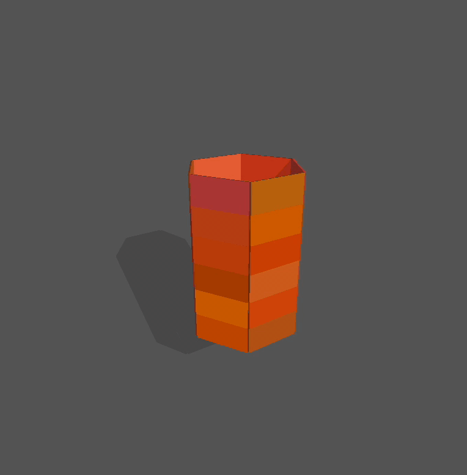

# PyKirigami: An Interactive Python Simulator for Kirigami Metamaterials

<div align="center">   </div>

## Table of Contents

1. [Overview](#overview)
2. [Installation](#installation)
3. [Quick Start](#quick-start)
4. [Input Data Format](#input-data-format)
   - 4.1 [Vertices File Format](#vertices-file-format)
   - 4.2 [Constraints File Format](#constraints-file-format)
   - 4.3 [Force Bricks File Format (Optional)](#force-bricks-file-format-optional)
5. [Command-Line Arguments](#command-line-arguments)
  - 5.1 [Required Arguments](#required-arguments)
  - 5.2 [Physics Parameters](#physics-parameters)
  - 5.3 [Force and Deployment Parameters](#force-and-deployment-parameters)
  - 5.4 [Geometry Parameters](#geometry-parameters)
  - 5.5 [Damping Parameters](#damping-parameters)
  - 5.6 [Visual Options](#visual-options)
6. [3D Tile Geometry and Normal Vector Orientation](#3d-tile-geometry-and-normal-vector-orientation)
   - 6.1 [Understanding Normal Vector Calculation](#understanding-normal-vector-calculation)
   - 6.2 [Vertex Ordering Guidelines](#vertex-ordering-guidelines)
   - 6.3 [Top vs Bottom Face Assignment](#top-vs-bottom-face-assignment)
   - 6.4 [Common Issues and Troubleshooting](#common-issues-and-troubleshooting)
7. [Inter-Tile Connections](#inter-tile-connections)
   - 7.1 [Connection Types](#connection-types)
     - 7.1.1 [Spherical Joints (Type 1 & 2)](#spherical-joints-type-1--2)
     - 7.1.2 [Hinge Connections](#hinge-connections)
     - 7.1.3 [Rigid Connections](#rigid-connections)
   - 7.2 [Constraint File Specification](#constraint-file-specification)
   - 7.3 [Best Practices for Defining Connections](#best-practices-for-defining-connections)
8. [Force Models and Deployment Mechanisms](#force-models-and-deployment-mechanisms)
   - 8.1 [Automatic Expansion Forces](#automatic-expansion-forces)
   - 8.2 [Manual Force Application](#manual-force-application)
   - 8.3 [Environmental Forces](#environmental-forces)
   - 8.4 [Parameter Tuning Guidelines](#parameter-tuning-guidelines)
9. [Interactive Controls](#interactive-controls)
   - 9.1 [Mouse Controls](#mouse-controls)
   - 9.2 [Keyboard Controls](#keyboard-controls)
   - 9.3 [Camera Navigation](#camera-navigation)
   - 9.4 [Tile Manipulation](#tile-manipulation)
10. [Example Projects](#example-projects)
    - 10.1 [2D-to-2D Deployments](#2d-to-2d-deployments)
      - 10.1.1 [Square-to-Circle Transformation](#square-to-circle-transformation)
      - 10.1.2 [Tangram Puzzle](#tangram-puzzle)
    - 10.2 [2D-to-3D Deployments](#2d-to-3d-deployments)
      - 10.2.1 [Fan Structure](#fan-structure)
      - 10.2.2 [Cylinder Formation](#cylinder-formation)
    - 10.3 [3D-to-3D Deployments](#3d-to-3d-deployments)
      - 10.3.1 [Cube-to-Sphere Transformation](#cube-to-sphere-transformation)
      - 10.3.2 [Tubular Structures](#tubular-structures)
11. [Advanced Usage](#advanced-usage)
    - 11.1 [Custom Force Application](#custom-force-application)
    - 11.2 [Simulation State Management](#simulation-state-management)
    - 11.3 [Data Export and Analysis](#data-export-and-analysis)
    - 11.4 [Performance Optimization](#performance-optimization)
12. [Troubleshooting](#troubleshooting)
    - 12.1 [Common Simulation Issues](#common-simulation-issues)
    - 12.2 [File Format Errors](#file-format-errors)
    - 12.3 [Physics Stability Problems](#physics-stability-problems)
    - 12.4 [Visualization Issues](#visualization-issues)
13. [Development and Extension](#development-and-extension)
    - 13.1 [Code Structure](#code-structure)
    - 13.2 [Adding New Features](#adding-new-features)
    - 13.3 [Custom Force Models](#custom-force-models)
    - 13.4 [Integration with Other Tools](#integration-with-other-tools)
14. [Technical Background](#technical-background)
    - 14.1 [PyBullet Physics Engine](#pybullet-physics-engine)
    - 14.2 [Rigid Body Dynamics](#rigid-body-dynamics)
    - 14.3 [Constraint Solving](#constraint-solving)
    - 14.4 [Numerical Considerations](#numerical-considerations)
15. [Frequently Asked Questions (FAQ)](#frequently-asked-questions-faq)
16. [Contributing](#contributing)
17. [Citation](#citation)
18. [License](#license)
19. [Contact](#contact)

---

## Overview

PyKirigami is an open-source Python toolbox for simulating the 2D and 3D deployment of general kirigami metamaterials. The simulator utilizes the PyBullet physics engine and is capable of simulating 2D-to-2D, 2D-to-3D, and 3D-to-3D kirigami deployments with interactive controls.

### Key Features
- **Multi-dimensional deployment simulation**: Support for 2D-to-2D, 2D-to-3D, and 3D-to-3D transformations
- **Physics-based simulation**: Powered by PyBullet for realistic physics behavior
- **Interactive controls**: Real-time manipulation and parameter adjustment
- **Flexible input format**: Support for arbitrary polygonal tiles and connection patterns
- **Multiple connection types**: Spherical joints, Fixed joints
- **Automated and manual deployment**: Both programmatic and interactive force application
- **Real-time visualization**: 3D rendering with camera controls and visual feedback

### Applications
- Kirigami metamaterial design and analysis
- Deployable structure simulation
- Mechanical metamaterial exploration
- Educational demonstrations of kirigami principles
- Research in shape-morphing materials

---

## Installation

### Prerequisites
- Python 3.7 or higher
- NumPy
- PyBullet


### Installation Steps
```bash
# Clone the repository
git clone [repository-url]
cd Kirigami_simulation_3D

# Install dependencies
pip install numpy pybullet
```

**Note**: You may encounter issues when installing PyBullet through pip, as it requires C++ dependencies to compile source files. For a smoother installation experience, we recommend using a conda environment with conda-forge, which provides pre-compiled and compitable packages. 

```bash
# Alternative installation using conda
conda create -n kirigami python=3.13
conda activate kirigami
conda install -c conda-forge numpy pybullet
```

# Run a test simulation

## Quick Start

### Target-Based Deployment (Recommended)
```bash
python run_sim.py --vertices_file data/partialSphere_vertices.txt --constraints_file data/partialSphere_constraints.txt --target_vertices_file data/partialSphere_target.txt --brick_thickness 0.02
```

### Basic Physics Simulation
```bash
python run_sim.py --vertices_file data/tangram_vertices.txt --constraints_file data/tangram_constraints.txt --ground_plane --gravity -100 --brick_thickness 0.2
```

### Running Your First Simulation
1. Prepare your input files (vertices, constraints, and optionally target vertices)
2. Run the simulation with basic parameters (default stiffness and damping are optimized)
3. Use mouse and keyboard controls to interact
4. Save simulation state when desired

**Note**: The default `spring_stiffness` (500.0) and `force_damping` (50.0) parameters are carefully tuned for stable deployment. (Aliases `target_stiffness`/`target_damping` are supported.) Advanced users can adjust these for specific behaviors.

---

## Input Data Format

### Vertices File Format
**Purpose**: Defines the geometric shape of each kirigami tile

**Format**: Each line represents one polygonal tile with `3n` space-separated float values
```
x1 y1 z1 x2 y2 z2 x3 y3 z3 ... xn yn zn
```


**Example** (Triangle):
```
0.0 0.0 0.0 1.0 0.0 0.0 0.5 1.0 0.0
```

**Example** (Quadrilateral):
```
0.0 0.0 0.0 1.0 0.0 0.0 1.0 1.0 0.0 0.0 1.0 0.0
```

**Important Notes**:
- Vertex ordering determines normal vector direction (right-hand rule)
- Consistent ordering across all tiles is crucial
- Each tile can have different numbers of vertices

### Constraints File Format
**Purpose**: Defines point-to-point connections between kirigami tiles


**Format**: Each line specifies a connection between two tiles
```
tile1_index vertex1_index tile2_index vertex2_index connection_type
```

**Connection Types**:
- `1`: Bottom vertex connection (spherical joint)
- `2`: Top vertex connection (spherical joint)

**Example**:
```
0 0 1 1 1
0 1 1 2 2
2 3 3 0 1
```

**Important Notes**:
- All connections are implemented as point-to-point constraints
- Tile indices and vertex indices refer to the order in the corresponding file (1-indexed)
- Connection type determines whether bottom or top face vertices are connected, the program will create bottom vertex connection if there is no specific assignment like connection [p,i,q,j] without type.
- All indices are converted to 0-based internally (subtract 1 from 1-based indices)

### Target Vertices File Format (Optional)
**Purpose**: Defines the desired final configuration for target-based deployment

**Format**: Same as vertices file - each line represents the target shape of each tile
```
x1 y1 z1 x2 y2 z2 x3 y3 z3 ... xn yn zn
```

**Requirements**:
- Must have the same number of tiles as the initial vertices file
- Each tile must have the same number of vertices as in the initial configuration
- Vertex order must match the initial configuration
- Constraint endpoints in target configuration should be close together (< 0.1 units)

---

## Command-Line Arguments

### Required Arguments
- `--vertices_file`: Path to initial vertices definition file
- `--constraints_file`: Path to constraints definition file

### Physics Parameters
- `--gravity`: Gravitational acceleration (default: 0)
- `--timestep`: Physics simulation timestep (default: 1/240)
- `--substeps`: Number of physics substeps per frame (default: 20)

### Force and Deployment Parameters
- `--target_vertices_file`: Path to target vertices configuration file (enables target-driven deployment)
- `--auto_expansion`: Enable automatic center-of-mass expansion (alternative to target-based)
- `--spring_stiffness`: Generic spring stiffness used by force models (alias of `--target_stiffness`)
- `--force_damping`: Generic damping used by force models (alias of `--target_damping`)

### Geometry Parameters
- `--brick_thickness`: Thickness of extruded 3D tiles (default: 0.02)

### Damping Parameters
- `--linear_damping`: Linear velocity damping (default: 1)
- `--angular_damping`: Angular velocity damping (default: 1)

### Visual Options
- `--ground_plane`: Add collision ground plane
- `--camera_distance`: Initial camera distance from origin (default: 8.0)

---

## 3D Tile Geometry and Normal Vector Orientation

### Understanding Normal Vector Calculation To Extrude Face
The normal vector is computed using the cross product of the first two edge vectors:
```
n = (v1 - v0) × (v2 - v0) / ||(v1 - v0) × (v2 - v0)||
```

### Vertex Ordering Guidelines
- **Consistent ordering**: Use either all clockwise or all counter-clockwise
- **Right-hand rule**: Determines which direction is "up" (positive normal)
- **Visual verification**: Check that all tiles extrude in expected directions


### Top vs Bottom Face Assignment
- **Bottom face**: Original vertices from input file
- **Top face**: Vertices translated along positive normal direction
- **Constraint types**: Type 1 connects bottom vertices, Type 2 connects top vertices

### Common Issues and Troubleshooting
- **Inverted tiles**: Check vertex ordering consistency
- **Connection failures**: Verify top/bottom vertex specifications
- **Unexpected orientations**: Validate normal vector directions

---

## Inter-Tile and Tile-World Connections

### Connection Types

#### Spherical Joints (Type 1 & 2)
- **Type 1**: Connect bottom vertices of two tiles
- **Type 2**: Connect top vertices of two tiles
- **Behavior**: Allows full rotational freedom around connection point
- **Use case**: Flexible hinges, ball-and-socket joints

#### Hinge Connections
- **Implementation**: Two spherical joints constraining rotation to one axis
- **Configuration**: Requires two constraint lines with shared tiles
- **Behavior**: Single-axis rotation
- **Use case**: Door hinges, folding mechanisms

#### Fixed Connections
- **Implementation**: PyBullet `JOINT_FIXED` constraints that eliminate all degrees of freedom
- **Tile-to-World**: Uses `fix_object_to_world()` to anchor tiles to world frame at current position/orientation
- **Configuration**: Applied programmatically through interactive controls (right-click) or pause mechanism
- **Behavior**: Complete immobilization - no translation or rotation
- **Use case**: Temporary anchoring, pause functionality, user-controlled tile fixing
- **Technical details**: 
  - Constraint created with `p.createConstraint()` using `p.JOINT_FIXED` type
  - High maximum force (`1e10`) ensures rigid attachment
  - Preserves current position and orientation when applied
  - Removable via `unfix_object_from_world()` to restore dynamics
- **Visual feedback**: Red sphere indicators show fixed tiles in interactive mode

---

## Force Models and Deployment Mechanisms

### Target-Based Deployment Forces

The simulator uses a sophisticated vertex-based force model to guide kirigami structures toward their target configurations. This system operates by applying forces to individual vertices and computing the resultant forces and torques for each tile.

#### Vertex-Based Force Calculation
**Individual Vertex Force**: For each vertex `i`:
```
F_i = k × (target_position_i - current_position_i)
```

**Net Force on Tile**: Sum of all vertex forces:
```
F_net = Σ F_i - μ_linear × v_linear
```

**Net Torque on Tile**: Cross product of position vectors and forces:
```
τ_net = Σ (r_i × F_i) - μ_angular × v_angular
```

Where:
- `k`: Spring stiffness parameter (`spring_stiffness`, alias: `target_stiffness`, default: 500.0)
- `μ_linear`: Linear damping coefficient (`force_damping`, alias: `target_damping`, default: 50.0)
- `μ_angular`: Angular damping from system parameters
- `r_i`: Vector from tile center to vertex `i`
- `v_linear`, `v_angular`: Linear and angular velocities

#### Real-Time Coordinate Transformation
The system dynamically computes current vertex positions by transforming local coordinates to world coordinates:
```
world_vertex_i = R × local_vertex_i + center_position
```
Where `R` is the rotation matrix derived from the tile's current orientation quaternion.

#### Force Application Process
1. **Vertex Position Update**: Transform local bottom vertices to current world coordinates
2. **Force Calculation**: Compute individual vertex forces toward target positions
3. **Force Summation**: Calculate net force and torque for each tile
4. **Damping Application**: Apply velocity-proportional damping
5. **Physics Integration**: Apply forces and torques through PyBullet

### Automatic Expansion Forces
This mode expands the structure from its computed center using a simple, stable model:

Per-tile force:
```
F = k * (pos - center) - c * v
```
Where `center` is the mean position of all tiles, `k = --spring_stiffness`, `c = --force_damping`.

Example:
```
python run_sim.py --vertices_file data/tangram_vertices.txt --constraints_file data/tangram_constraints.txt --auto_expansion --spring_stiffness 80 --force_damping 10 --brick_thickness 0.05
```

### Environmental Forces
- **Gravity**: Configurable magnitude and direction (default: 0, disabled)
- **System Damping**: Linear and angular velocity reduction (`linear_damping`, `angular_damping`)
- **Ground Plane**: Optional collision surface for realistic physics interaction

### Manual Interaction Forces
- **Right-click fixing**: Uses constraint-based object fixing (see Interactive Controls)
- **Physics manipulation**: Direct interaction through PyBullet's built-in camera controls
- **Pause mechanism**: Constraint-based freezing of all objects

### Parameter Tuning Guidelines
- **Start with defaults**: `spring_stiffness=500.0`, `force_damping=50.0` are optimized for most cases
- **Increase stiffness**: 750-1000 for faster deployment (monitor stability)
- **Increase damping**: 75-150 if oscillations occur
- **Adjust timestep**: Smaller values (1/480) for high-stiffness simulations
- **Balance forces**: Higher stiffness requires proportional damping increase

---

## Interactive Controls

### Mouse Controls
- **Left-click + drag**: Apply forces to tiles
- **Right-click on tile**: Toggle fix/unfix (red sphere indicates fixed)
- **Scroll wheel**: Zoom in/out
- **Ctrl + left-click + drag**: Rotate camera
- **Ctrl + right-click + drag**: Zoom
- **Ctrl + middle-click + drag**: Pan camera

### Keyboard Controls
- **R**: Reset simulation to initial state
- **S**: Save current vertex positions
- **P**: Toggle pause/resume simulation (uses fixed constraints for stable pausing)
- **Q**: Quit simulation

> **Note**: The pause functionality (P key) now uses PyBullet's fixed constraints to freeze all objects in place, preventing unwanted movement due to gravity or residual forces. This provides much more stable pausing behavior compared to velocity-based methods.

### Camera Navigation
[Detailed camera control instructions]

### Tile Manipulation
[Instructions for interacting with individual tiles]

---

## Example Projects

### Target-Based Deployments (Recommended)

#### Partial Sphere Deployment
```bash
python run_sim.py --vertices_file data/partialSphere_vertices.txt --constraints_file data/partialSphere_constraints.txt --target_vertices_file data/partialSphere_target.txt --brick_thickness 0.02
```
*Uses default optimized parameters: `spring_stiffness=500.0`, `force_damping=50.0` (aliases supported)*

#### Cylinder Formation
```bash
python run_sim.py --vertices_file data/cylinder_w8_h2_vertices.txt --constraints_file data/cylinder_w8_h2_constraints.txt --target_vertices_file data/cylinder_target.txt --brick_thickness 0.1 --camera_distance 15
```
*Default parameters work well for most cylinder deployments*


### Basic Physics Simulations

#### Tangram Puzzle with Gravity
```bash
python run_sim.py \
    --vertices_file data/tangram_vertices.txt \
    --constraints_file data/tangram_constraints.txt \
    --angular_damping 2.5 \
    --linear_damping 2.5 \
    --ground_plane \
    --gravity -100 \
    --brick_thickness 0.2
```
*Higher damping prevents excessive bouncing under gravity*

#### Fan Structure for Interactive Manipulation
```bash
python run_sim.py \
    --vertices_file data/fan_R10_r1_w3_h3_vertices.txt \
    --constraints_file data/fan_R10_r1_w3_h3_constraints.txt \
    --ground_plane \
    --gravity -100 \
    --brick_thickness 0.1
```
*Good for testing interactive controls and manual manipulation*

### Parameter Tuning Examples

#### High-Stiffness Deployment (Fast but Potentially Unstable)
```bash
python run_sim.py \
    --vertices_file data/partialSphere_vertices.txt \
    --constraints_file data/partialSphere_constraints.txt \
    --target_vertices_file data/partialSphere_target.txt \
  --spring_stiffness 1000.0 \
  --force_damping 75.0 \
    --brick_thickness 0.02
```

#### Low-Stiffness Deployment (Very Stable but slow and even cannnot be deployed)
```bash
python run_sim.py \
    --vertices_file data/partialSphere_vertices.txt \
    --constraints_file data/partialSphere_constraints.txt \
    --target_vertices_file data/partialSphere_target.txt \
  --spring_stiffness 200.0 \
  --force_damping 25.0 \
    --brick_thickness 0.02
```

#### High-Precision Simulation (Smaller Timestep)
```bash
python run_sim.py \
    --vertices_file data/cube2sphere_w4_h4_vertices.txt \
    --constraints_file data/cube2sphere_w4_h4_constraints.txt \
    --target_vertices_file data/cube2sphere_w4_h4_target.txt \
    --timestep 0.00208 \
    --substeps 30 \
  --spring_stiffness 750.0
```
**Note**: The value 0.00208 represents 1/480, which requires decimal input via command line (e.g., `--timestep 0.002083`). Be aware that smaller timesteps significantly increase computational cost while potentially providing diminishing returns in simulation accuracy.


**Key Parameter Guidelines:**
- **Default parameters** (`spring_stiffness=500.0`, `force_damping=50.0`) work for most simulations
- **Increase stiffness** (750-1000) for faster deployment, but monitor stability
- **Increase damping** (75-150) if oscillations occur
- **Adjust timestep** (1/480 to 1/120) based on stability vs. performance needs

---

## Advanced Usage
[Advanced features and customization options]

---

## Troubleshooting

### Common Simulation Issues

#### Unstable Simulation
- **Symptoms**: Objects jittering, exploding, or moving erratically
- **Solutions**: 
  - Reduce `spring_stiffness` from default 500.0 to 100.0-300.0
  - Increase `force_damping` from default 50.0 to 75.0-100.0
  - Decrease physics `timestep` to 1/480 or smaller
  - Increase `substeps` to 30-50 for better numerical stability

#### Slow or No Deployment
- **Symptoms**: Target-based deployment progresses very slowly or stalls
- **Solutions**:
  - Increase `spring_stiffness` gradually (try 750.0-1000.0)
  - Ensure target vertices file is correctly formatted
  - Check that target configuration is physically achievable
  - Verify constraint connections allow required movement

#### Objects Fall Through Ground
- **Symptoms**: Simulation objects pass through the ground plane
- **Solutions**:
  - Enable `--ground_plane` option
  - Check that gravity is set appropriately (try `--gravity -100`)
  - Increase collision margin in physics settings

#### Excessive Oscillation
- **Symptoms**: Objects vibrate or oscillate around target positions
- **Solutions**:
  - Increase `force_damping` to 75.0-150.0
  - Increase system damping: `--linear_damping 2.5 --angular_damping 2.5`
  - Reduce `spring_stiffness` for gentler convergence
  - Check timestep is appropriate for force magnitudes

### File Format Errors

#### Vertex Count Mismatch
- **Error**: Target file has different number of tiles than initial vertices
- **Solution**: Ensure target vertices file has exactly same number of lines as vertices file


#### Parsing Errors
- **Error**: "could not convert string to float" or similar
- **Solution**:
  - Ensure all values in vertices files are numeric
  - Check for extra spaces, tabs, or special characters
  - Verify file encoding is UTF-8 or ASCII

### Physics Stability Problems

#### Constraint Violations
- **Symptoms**: Connected tiles separate or behave unexpectedly
- **Solutions**:
  - Check constraint distances in target configuration using built-in validation: `python -c "from utils.setup import validate_constraints; from utils.setup import load_vertices_from_file, load_constraints_from_file; validate_constraints(load_vertices_from_file('vertices/target_vertices.txt'), load_constraints_from_file('constraints.txt'))"`
  - Such error usually happens when one makes mistake on vertex order of faces and we have integrate validation into out project
  - Verify constraint types (1 vs 2) match intended connection points

#### Rigid Body Interpenetration
- **Symptoms**: Tiles overlap or pass through each other
- **Solutions**:
  - Increase collision margins: modify `brick_thickness` parameter
  - Reduce timestep for better collision detection
  - Check initial configuration for pre-existing overlaps

#### Energy Buildup
- **Symptoms**: System gains energy over time, becomes increasingly unstable
- **Solutions**:
  - Increase damping parameters systematically
  - Check for constraint conflicts (over-constrained systems)
  - Verify target configuration is physically realistic

### Target Deployment Issues

#### Target Validation Failures
- **Error**: "ERROR: Constraint X has large distance in target vertices"
- **Solution**:
  - Check target vertices file for constraint endpoint distances
  - Modify target configuration to bring constraint points closer
  - Consider using intermediate target configurations for complex deployments

#### Incomplete Deployment
- **Symptoms**: Deployment stops before reaching target configuration
- **Solutions**:
  - Increase `spring_stiffness` gradually (monitor stability)
  - Check for mechanical constraints preventing full deployment
  - Verify target configuration is kinematically achievable
  - Try reducing `force_damping` for more dynamic behavior

#### Force Application Issues
- **Symptoms**: Target forces seem ineffective or misdirected
- **Solutions**:
  - Verify vertex ordering consistency between initial and target files
  - Check normal vector orientations are correct
  - Ensure target vertices maintain same vertex count per tile

### Performance and Memory Issues

#### Slow Simulation
- **Solutions**:
  - Increase timestep (reduce precision for speed): `--timestep 1/120`
  - Reduce substeps: `--substeps 10`
  - Disable shadows: modify debug visualizer settings in code
  - Reduce number of tiles in simulation

#### Memory Usage
- **Solutions**:
  - Clear output files periodically (simulation saves can accumulate)
  - Restart simulation for long-running experiments
  - Monitor system resources during large simulations

### Interactive Control Issues

#### Mouse Selection Problems
- **Symptoms**: Cannot select tiles with right-click
- **Solutions**:
  - Ensure camera is positioned appropriately
  - Check that tiles are visible (not hidden behind others)
  - Try different camera angles
  - Verify PyBullet ray casting is working (restart simulation)

#### Fixed Objects Not Responding
- **Symptoms**: Fixed tiles (with red spheres) still move
- **Solutions**:
  - Check that constraint forces are sufficient (`max_force` parameter)
  - Verify fixed constraints are properly created
  - Restart simulation if constraint system becomes corrupted

#### Keyboard Commands Not Working
- **Solutions**:
  - Ensure PyBullet window has focus
  - Check for key repeat issues (press once, wait for response)
  - Verify keyboard events are being captured in terminal output

---

## Development and Extension

### Code Structure


The simulator follows a clear three-controller architecture with distinct responsibilities:


#### Core Modules (`core/`)
- **`simulation.py`**: Simulation initialization and setup
  - `Simulation` class handles **initialization only**: loading data, creating bodies, setting up constraints
  - Integrates physics setup, geometry creation, and constraint management during initialization
  - Provides clean interface for simulation setup and data preparation
  

- **`simulation_controller.py`**: Runtime control and force application  
  - `SimulationController` handles **keyboard events and force application**
  - Processes keyboard events (R-reset, S-save, P-pause, Q-quit)
  - Applies target-based forces during simulation runtime
  - Manages simulation state transitions (pause/resume, reset)
  - Coordinates physics stepping with PyBullet engine

- **`interaction_controller.py`**: Mouse-based interaction system
  - `InteractionController` manages **mouse events only**
  - Implements ray casting for precise tile selection via right-click
  - Handles fix/unfix operations with visual feedback (red sphere indicators)
  - Processes mouse events and camera-relative coordinate transformation

#### Utility Modules (`utils/`)
- **`physics_utils.py`**: Centralized physics manipulation utilities
  - `fix_object_to_world()` / `unfix_object_from_world()`: Object constraint management
  - `fix_multiple_objects_to_world()`: Batch operations for pause functionality
  - `create_visual_indicator()` / `remove_visual_indicator()`: Visual feedback system
  - `setup_physics_engine()`: PyBullet initialization with optimized parameters

- **`geometry.py`**: 3D geometry calculations and mesh generation
  - `create_extruded_geometry()`: Converts 2D polygons to 3D extruded shapes
  - `create_brick_body()`: PyBullet rigid body creation with collision shapes
  - `create_constraints_between_bricks()`: Point-to-point constraint generation
  - `transform_local_to_world_coordinates()`: Coordinate system transformations
  - Normal vector computation and coordinate system management

- **`config.py`**: Configuration and argument parsing (renamed from `setup.py`)
  - `load_vertices_from_file()` / `load_constraints_from_file()`: Input file parsing
  - `validate_constraints()`: Constraint validation to ensure compatibility
  - `parse_arguments()`: Command-line interface definition
  - Parameter default value management

#### Central Simulation Data Structure

The simulation maintains a central data dictionary that coordinates state across all modules:

| **Component** | **Type** | **Description** |
|---------------|----------|-----------------|
| `args` | Configuration object | User-defined simulation parameters including gravity, damping coefficients, and brick thickness |
| `bricks` | List of integers | PyBullet body IDs for all kirigami tiles, used for applying forces and querying state |
| `local_coords` | Nested coordinate arrays | Local vertex coordinates organized per tile, enabling efficient world-space transformations |
| `constraint_ids` | List of integers | PyBullet constraint IDs representing connections between tiles |
| `target_vertices` | Nested coordinate arrays | Target positions for all vertices during deployment (optional) |

**Data Flow**:
1. **Initialization**: `Simulation` class creates and populates this structure
2. **Runtime**: `SimulationController` and `InteractionController` read from this structure
3. **Reset**: `SimulationController` recreates the structure using stored `args`
4. **Updates**: Only the `SimulationController` modifies the structure during reset operations


#### Main Entry Point
- **`run_sim.py`**: Application entry point and simulation orchestration
  - Coordinates initialization of all three controller subsystems
  - Creates and manages the central simulation data structure  
  - Implements the main simulation loop with keyboard/mouse event processing
  - Handles graceful shutdown and resource cleanup
  - Provides comprehensive command-line interface and usage examples
  - **Architecture Integration**: 
    - Instantiates `Simulation` for initialization
    - Creates `SimulationController` with simulation data for runtime control
    - Sets up `InteractionController` for mouse-based user interaction

#### Design Principles
- **Modular Architecture**: Clear separation of concerns across three main controllers
  - **Initialization**: `Simulation` class handles setup and data preparation
  - **Runtime Control**: `SimulationController` manages physics stepping and force application  
  - **User Interaction**: `InteractionController` processes mouse events
- **Centralized Data**: Unified simulation data structure coordinates state across modules
- **Clean Interfaces**: Modules communicate through well-defined APIs and shared data structure
- **Error Handling**: Comprehensive validation and graceful error recovery
- **Performance Optimization**: Physics engine tuned for stability and speed

#### Extension Points
- **Custom Force Models**: Extend force application methods in `SimulationController`
- **New Interaction Modes**: Add methods to `InteractionController` class
- **File Format Support**: Extend data loading functions in `config.py`
- **Visualization Features**: Modify rendering setup in `physics_utils.py`
- **Simulation Analytics**: Access central data structure for real-time analysis


---

## Frequently Asked Questions (FAQ)
[Common questions and answers]


---

## Citation
```bibtex
@article{pykirigami2025,
    title = {PyKirigami: An interactive Python simulator for kirigami metamaterials},
    author = {Jiang, Qinghai and Choi, Gary P. T.},
    journal = {arXiv preprint arXiv:2508.15753},
    url = {https://arxiv.org/abs/2508.15753},
    year = {2025}
}
```

---

## License
[License information]

---

## Contact
- **Qinghai Jiang**: qhjiang@math.cuhk.edu.hk
- **Gary P. T. Choi**: ptchoi@cuhk.edu.hk
- **Department of Mathematics, The Chinese University of Hong Kong**
